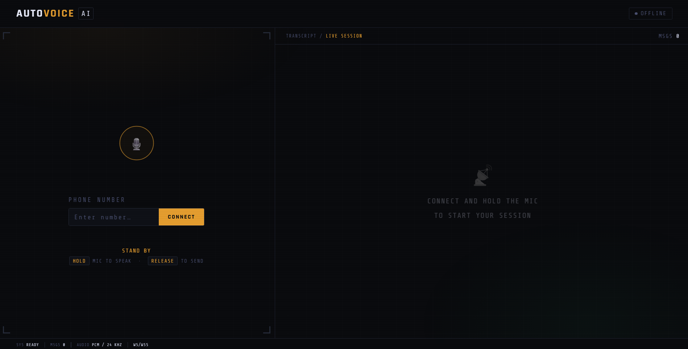
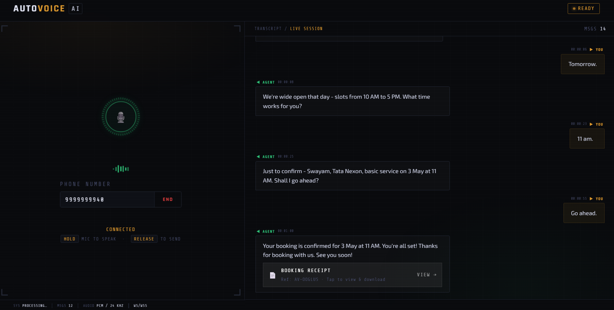
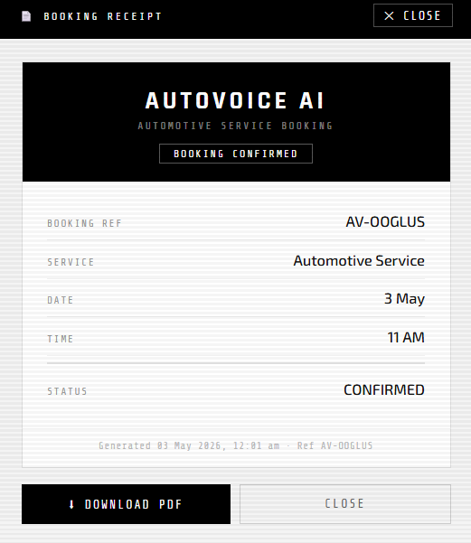
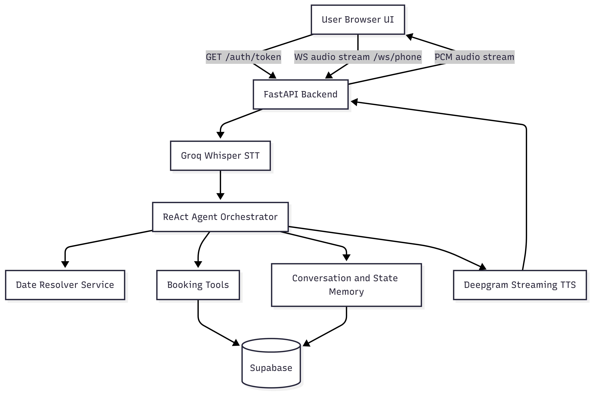

# AutoVoice-AI

[](https://www.python.org/)
[](https://fastapi.tiangolo.com/)
[](https://render.com/)
[](https://supabase.com/)
[](https://groq.com/)
[](https://deepgram.com/)
[](LICENSE)

Voice-first AI receptionist for automobile service booking.

## Live Project
`https://autovoice-ai.onrender.com`

## Screenshots




## What this project does
- Accepts live caller audio from a browser UI.
- Transcribes user speech and manages multi-turn booking conversations.
- Supports both new bookings and existing booking modifications.
- Checks service slot availability before confirmation.
- Creates/updates booking data in Supabase.
- Streams synthesized voice replies back to the caller in real time.
- Shows transcript in the UI and generates a downloadable booking receipt.

## How this project works
1. Frontend calls HTTP GET endpoint `GET /auth/token` with query parameter `phone` to receive a short-lived token.
2. Frontend opens a WebSocket connection to endpoint `/ws/{phone}` with query parameter `token` (`/ws/{phone}?token=...`).
3. Client sends recorded audio frames to the WebSocket endpoint.
4. Backend performs speech-to-text and passes transcript to the agent.
5. Agent decides action (`update_state`, `call_tool`, `ask_user`, `final_booking`) using persisted state/history.
6. Tool layer interacts with Supabase for slots, bookings, and vehicle information.
7. Agent response text is converted to streaming audio and sent back over the WebSocket connection.

## Architecture


## Tech Stack
- Backend Framework: FastAPI (`0.136.1`)
- ASGI Server: Uvicorn (`0.46.0`)
- Frontend: HTML, CSS, Vanilla JavaScript
- Database/Persistence: Supabase
- LLM: Groq Chat Completions using `llama-3.3-70b-versatile` (configurable via `GROQ_MODEL`)
- STT: Groq Whisper using `whisper-large-v3-turbo`
- TTS: Deepgram Streaming TTS using model `aura-asteria-en`

## Project Structure
```text
AutoVoice-AI/
├── app/
│   ├── main.py                     # FastAPI app entrypoint, CORS, lifespan, frontend serving
│   ├── api/
│   │   └── routes.py               # HTTP and WebSocket transport endpoints
│   ├── agents/
│   │   ├── agent.py                # Core ReAct orchestration and tool-calling loop
│   │   ├── prompts.py              # System prompt rules and JSON action contract
│   │   └── state.py                # Per-caller state load/save and booking readiness checks
│   ├── services/
│   │   ├── speech_service.py       # STT/TTS integration and phrase-cache warming
│   │   ├── booking_service.py      # Slot lookup and booking create/update operations
│   │   ├── date_service.py         # Natural-language date resolution to YYYY-MM-DD
│   │   ├── memory_service.py       # Conversation logs and last-booking summary persistence
│   │   └── slot_service.py         # Slot generation and conflict detection rules
│   ├── core/
│   │   ├── config.py               # Environment config and startup validation
│   │   ├── auth.py                 # Phone validation, token issue/verify, sanitization, rate limits
│   │   └── logger.py               # Structured app/access/error logging and action logging
│   ├── tools/
│   │   ├── booking_tools.py        # Agent-callable wrappers around booking operations
│   │   └── tool_registry.py        # Tool map used by tool layer
│   └── db/
│       └── supabase_client.py      # Supabase client initialization
├── frontend/
│   ├── index.html                  # Main UI shell
│   ├── app.js                      # Realtime audio flow, WebSocket client, transcript, receipt UI
│   └── styles.css                  # UI styling and responsive layout
├── .env.example                    # Required environment variable template
├── requirements.txt                # Python dependencies
├── LICENSE                         # MIT license
└── README.md
```

## Installation
### 1) Clone repository
```bash
git clone https://github.com/Swayam-S-Bora/AutoVoice-AI.git
cd AutoVoice-AI
```

### 2) Create and activate virtual environment
Windows (PowerShell):
```powershell
python -m venv .venv
.venv\Scripts\Activate.ps1
```

macOS/Linux:
```bash
python -m venv .venv
source .venv/bin/activate
```

### 3) Install dependencies
```bash
pip install -r requirements.txt
```

### 4) Configure environment variables
Create a `.env` file and set:
- `GROQ_API_KEY`
- `GROQ_MODEL` (default: `llama-3.3-70b-versatile`)
- `SUPABASE_URL`
- `SUPABASE_KEY`
- `DEEPGRAM_API_KEY`
- `ALLOWED_ORIGINS` (comma-separated domains)

## Execution
### Run locally
```bash
uvicorn app.main:app --host 0.0.0.0 --port 8000 --reload
```

Open:
- `http://localhost:8000`

### Production command
```bash
uvicorn app.main:app --host 0.0.0.0 --port $PORT
```

## API and Realtime Endpoints
- `GET /` - serves frontend
- `GET /auth/token` - issues short-lived token (query parameter: `phone`)
- `POST /chat` - debug endpoint for text input and streaming audio output
- WebSocket endpoint `/ws/{phone}` - real-time duplex audio session (query parameter: `token`)
- `GET /healthz` - health check

## License
MIT License. See `LICENSE`.
